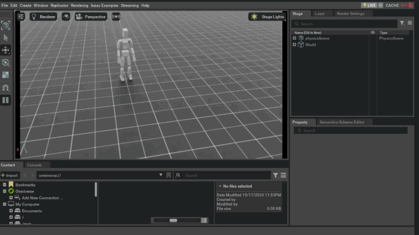

[](https://mseep.ai/app/zhengyiluo-phc)

# Perpetual Humanoid Control for Real-time Simulated Avatars

Official implementation of ICCV 2023 paper: "Perpetual Humanoid Control for Real-time Simulated Avatars". In this paper, we present a physics-based humanoid controller that achieves high-fidelity motion imitation and fail-statue recovery in the presence of noisy input (e.g. pose estimates from video or generated from language) and unexpected falls. No external forces is used. 

[[paper]](https://arxiv.org/abs/2305.06456) [[website]](https://zhengyiluo.github.io/PHC/) [[Video]](https://www.youtube.com/watch?v=zS6Y00EW37A)

<div float="center">

  
  
</div>

# Table of Contents
* [News 🚩](#news-)
* [TODOs](#todos)
* [Introduction](#introduction)
    * [Docs](#docs)
    * [Current Results on Cleaned AMASS (11313 Sequences)](#current-results-on-cleaned-amass-11313-sequences)
    * [Dependencies](#dependencies)
* [Evaluation](#evaluation)
    * [Minimal Viable Evaluation](#minimal-viable-evaluation)
    * [Viewer Shortcuts](#viewer-shortcuts)
    * [Imitation](#imitation)
    * [In-the-wild Avatar Control](#in-the-wild-avatar-control)
    * [VR Controller Tracking](#vr-controller-tracking)
* [Training](#training)
    * [Data Processing AMASS](#data-processing-amass)
    * [Training PHC](#training-phc)
* [Trouble Shooting](#trouble-shooting)
    * [Multiprocessing Issues](#multiprocessing-issues)
    * [Success Rate](#success-rate)
* [Citation](#citation)
* [References](#references)

## News 🚩

[August 21, 2025] Adding sample eval code in IsaacLab. PHC policy can directly be inferred in IsaacLab. `python scripts/eval_in_isaaclab.py`. 

[December 10, 2024] Release process for generating offline dataset (PHC_Act) for offline RL or behavior cloning (developed by [@kangnil](https://github.com/kangnil)). See [docs/offline_dataset.md](docs/offline_dataset.md) for more details. 

[December 9, 2024] Release retargeting [documentation](docs/retargeting.md) (for retargeting to your own humanoids using SMPL data). 

[October 8, 2024] Release support for Unitree H1 and G1 humanoid. 

[August 30, 2024] Release support for SMPLX humanoid. 

[Apirl 5, 2024] Upgrading to use [SMPLSim](https://github.com/ZhengyiLuo/SMPLSim) to automatically create the SMPL humanoid. Please run `pip install git+https://github.com/ZhengyiLuo/SMPLSim.git@master` to SMPLSim. SMPLSim requires python 3.8; for python 3.7, please `pip install git+https://github.com/ZhengyiLuo/SMPLSim.git@isaac37`.

[Feburary 28, 2024] Releasing Auto-PMCP procedure to train single primitives; this procedure can lead to very high-performant imiatators without PNN, though it wouldn't have the failure state recovery capability. See the `auto_pmcp_soft` flag. 

[Feburary 19, 2024] Releasing PHC+ model (100% success rate on AMASS) used in [PULSE](https://zhengyiluo.github.io/PULSE/).

[Feburary 17, 2024] Fixed a bug when overhauling the system to Hydra. Please pull the newest version :). 

[Feburary 1, 2024] Overhauling the config system to Hydra. 

[January 8, 2024] Support for running inference without SMPL model. 

[January 7, 2024] Release language-to-control demo (based on MDM). 

[December 19, 2023] Release VR controller tracking code. 

[December 14, 2023] Release webcam video-based control demo. 

[October 31, 2023] Remove dependency on mujoco 210 and update to the newest mujoco version (for creating xml robot; no more downloads and direct install with `pip install mujoco`!). Updated amass_occlusion_v3 to 11313 sequences for training (was 11315). Updated requirement.txt. 

[October 25, 2023] Training and Evaluation code released.


## TODOs

- [x] Add support for Unitree H1 & G1.

- [x] Add support for smplx/h (fingers!!!).

- [x] Release PHC+ model (100% success rate on AMASS) used in [PULSE](https://zhengyiluo.github.io/PULSE/). 

- [x] Release language-based demo code.  

- [x] Release vr controller tracking code.  

- [x] Release video-based demo code.  

- [x] Additional instruction on Isaac Gym SMPL robot. 

- [x] Release training code. 

- [x] Release evaluation code. 

## Introduction
We present a physics-based humanoid controller that achieves high-fidelity motion imitation and fault-tolerant behavior in the presence of noisy input (e.g. pose estimates from video or generated from language) and unexpected falls. Our controller scales up to learning ten thousand motion clips without using any external stabilizing forces and learns to naturally recover from fail-state. Given reference motion, our controller can perpetually control simulated avatars without requiring resets. At its core, we propose the progressive multiplicative control policy (PMCP), which dynamically allocates new network capacity to learn harder and harder motion sequences. PMCP allows efficient scaling for learning from large-scale motion databases and adding new tasks, such as fail-state recovery, without catastrophic forgetting. We demonstrate the effectiveness of our controller by using it to imitate noisy poses from video-based pose estimators and language-based motion generators in a live and real-time multi-person avatar use case.

> ❗️❗️❗️Notice that the current released models used a different coordinate system as SMPL (with negative z as gravity direction), and the humanoid is modifed in a way such that it is facing positive x direction (instead of the original SMPL facing). This is reflected in a "up_right_start" flag in the humanoid robot (`smpl_local_robot.py`) configuration. This is done to make the humanoid's heading to be eailerly defined and flipping left and right easier, but would require further modification for converting back to SMPL (which is provided in the code). In the future I am working towards removing this modification. 

> ❗️❗️❗️ Another notice is that while the MCP/Mixture of expert model is great for achieving high success rate, it is not absolutely necessary for the PHC to work. The PHC can work with a single primitive model and achieves high success rate; though it wouldn't have the failure state recovery capability.

### Docs 
- [Docs on SMPL_Robot](docs/smpl_robot_instruction.MD)
- [Docker Instructions](docs/docker_instruction.MD) (from [@kexul](https://github.com/kexul))
- [Webcam Demo](docs/video_to_control_demo.md) 
- [Language Demo](docs/language_to_control_demo.md) 
- [Retargeting to Your Own Humanoids](docs/retargeting.md)
- [Offline Dataset (PHC_Act)](docs/offline_dataset.md)

### Current Results on Cleaned AMASS (11313 Sequences)

All evaluation is done using the mean SMPL body pose and adjust the height, using the same evaluation protocal as in [UHC](https://github.com/ZhengyiLuo/UniversalHumanoidControl/tree/master). Noticed that different evaluation protocal will lead to different results, and Isaac gym itself can lead to (slightly) different results based on batch size/machine setup. 

| Models         | Succ | G-MPJPE | ACC |
|----------------|:----:|:------------:|:----:|
| PHC           | 98.9% |     37.5     | 3.3 |
| PHC-KP          | 98.7% |     40.7     | 3.5 |
| PHC+ [in Pulse](https://zhengyiluo.github.io/PULSE/)  | 100% |     26.6     | 2.7 |
| PHC-Prim (single primitive) | 99.9% |     25.9     | 2.3 |
| PHC-Fut (using future) | 100% |     25.3     | 2.5 |
| PHC-X-Prim (single primitive) | 99.9% |     24.7     | 3.6 |

### Dependencies

To create the environment, follow the following instructions: 

1. Create new conda environment and install pytroch:


```
conda create -n isaac python=3.8
conda install pytorch torchvision torchaudio pytorch-cuda=11.6 -c pytorch -c nvidia
pip install -r requirement.txt
```

2. Download and setup [Isaac Gym](https://developer.nvidia.com/isaac-gym). 


3. Download SMPL paramters from [SMPL](https://smpl.is.tue.mpg.de/) and [SMPLX](https://smpl-x.is.tue.mpg.de/download.php). Put them in the `data/smpl` folder, unzip them into 'data/smpl' folder. For SMPL, please download the v1.1.0 version, which contains the neutral humanoid. Rename the files `basicmodel_neutral_lbs_10_207_0_v1.1.0`, `basicmodel_m_lbs_10_207_0_v1.1.0.pkl`, `basicmodel_f_lbs_10_207_0_v1.1.0.pkl` to `SMPL_NEUTRAL.pkl`, `SMPL_MALE.pkl` and `SMPL_FEMALE.pkl`. For SMPLX, please download the v1.1 version. Rename The file structure should look like this:

```

|-- data
    |-- smpl
        |-- SMPL_FEMALE.pkl
        |-- SMPL_NEUTRAL.pkl
        |-- SMPL_MALE.pkl
        |-- SMPLX_FEMALE.pkl
        |-- SMPLX_NEUTRAL.pkl
        |-- SMPLX_MALE.pkl

```


4. Use the following script to download trained models and sample data.

```
bash download_data.sh
```

this will download amass_isaac_standing_upright_slim.pkl, which is a standing still pose for testing. 

To evaluate with your own SMPL data, see the script `scripts/data_process/convert_data_smpl.py`. Pay speical attention to make sure the coordinate system is the same as the one used  in simulaiton (with negative z as gravity direction). 

Make sure you have the SMPL paramters properly setup by running the following scripts:
```
python scripts/vis/vis_motion_mj.py
python scripts/joint_monkey_smpl.py
```

The SMPL model is used to adjust the height the humanoid robot to avoid penetnration with the ground during data loading. 


## Evaluation 


### Viewer Shortcuts

| Keyboard | Function |
| ---- | --- |
| f | focus on humanoid |
| Right click + WASD | change view port |
| Shift + Right click + WASD | change view port fast |
| r | reset episode |
| j | apply large force to the humanoid |
| l | record screenshot, press again to stop recording|
| ; | cancel screen shot|
| m | cancel termination based on imitation |

... more shortcut can be found in `phc/env/tasks/base_task.py`

Notes on rendering: I am using pyvirtualdisplay to record the video such that you can see all humanoids at the same time (default function will only capture the first environment). You can disable it using the flag `no_virtual_display=True`. 

You can use the `render_o3d=True no_virtual_display=True` flag to render the SMPL mesh together with your Isaac Gym simulation in real time like this: 
<div float="center">
  
</div>

to do the above visulaization, press m (to cancel termination based on imitation), and then press j (to apply a large force to the humanoid). 

### Imitation 

#### SMPL and SMPL-X

PHC-X-Prim (single primitive model)
```
python phc/run_hydra.py learning=im_pnn_big exp_name=phc_x_pnn  env=env_im_x_pnn robot=smplx_humanoid env.motion_file=sample_data/standing_x.pkl env.training_prim=0 epoch=-1 test=True  env.num_envs=1  headless=False
```

PHC+: keypoint model, can getup from the ground and walk back) | Best model for video/language model
```
python phc/run_hydra.py learning=im_mcp_big learning.params.network.ending_act=False exp_name=phc_comp_kp_2 env.obs_v=7 env=env_im_getup_mcp robot=smpl_humanoid robot.real_weight_porpotion_boxes=False env.motion_file=sample_data/amass_isaac_standing_upright_slim.pkl env.models=['output/HumanoidIm/phc_kp_2/Humanoid.pth'] env.num_prim=3 env.num_envs=1  headless=False epoch=-1 test=True
```

PHC+: rotation + keypoint model, can getup from the ground but not walk back -- model used in PULSE due to time constraint
```
python phc/run_hydra.py learning=im_mcp_big  exp_name=phc_comp_3 env=env_im_getup_mcp robot=smpl_humanoid env.zero_out_far=False robot.real_weight_porpotion_boxes=False env.num_prim=3 env.motion_file=sample_data/amass_isaac_standing_upright_slim.pkl env.models=['output/HumanoidIm/phc_3/Humanoid.pth'] env.num_envs=1  headless=False epoch=-1 test=True
```

Evaluate full model:

```
## Shape + rotation + keypoint model

python phc/run_hydra.py learning=im_mcp exp_name=phc_shape_mcp_iccv test=True env=env_im_getup_mcp robot=smpl_humanoid_shape robot.freeze_hand=True robot.box_body=False env.z_activation=relu env.motion_file=sample_data/amass_isaac_standing_upright_slim.pkl env.models=['output/HumanoidIm/phc_shape_pnn_iccv/Humanoid.pth'] env.num_envs=1  headless=False epoch=-1


## keypoint model
python phc/run_hydra.py learning=im_mcp exp_name=phc_kp_mcp_iccv  test=True env=env_im_getup_mcp robot=smpl_humanoid robot.freeze_hand=True robot.box_body=False env.z_activation=relu env.motion_file=sample_data/amass_isaac_standing_upright_slim.pkl env.models=['output/HumanoidIm/phc_kp_pnn_iccv/Humanoid.pth'] env.num_envs=1 env.obs_v=7 headless=False epoch=-1

```

Evaluate on AMASS:

```
## rotation + keypoint model (100% - PHC+)
python phc/run_hydra.py learning=im_mcp_big  exp_name=phc_comp_3 env=env_im_getup_mcp robot=smpl_humanoid env.zero_out_far=False robot.real_weight_porpotion_boxes=False env.num_prim=3 env.motion_file=sample_data/amass_isaac_standing_upright_slim.pkl env.models=['output/HumanoidIm/phc_3/Humanoid.pth'] env.num_envs=1  headless=False im_eval=True


## Shape + rotation + keypoint model
python phc/run_hydra.py learning=im_mcp exp_name=phc_shape_mcp_iccv epoch=-1 test=True env=env_im_getup_mcp robot=smpl_humanoid_shape robot.freeze_hand=True robot.box_body=False env.z_activation=relu env.motion_file=sample_data/amass_isaac_standing_upright_slim.pkl env.models=['output/HumanoidIm/phc_shape_pnn_iccv/Humanoid.pth'] env.num_envs=1  headless=False im_eval=True


## keypoint model
python phc/run_hydra.py learning=im_mcp exp_name=phc_kp_mcp_iccv epoch=-1 test=True env=env_im_getup_mcp robot=smpl_humanoid robot.freeze_hand=True robot.box_body=False env.z_activation=relu env.motion_file=sample_data/amass_isaac_standing_upright_slim.pkl env.models=['output/HumanoidIm/phc_kp_pnn_iccv/Humanoid.pth'] env.num_envs=1024 env.obs_v=7  im_eval=True
```

Evaluate single primitive model:

```
## Shape + rotation + keypoint model
python phc/run_hydra.py learning=im_pnn exp_name=phc_shape_pnn_iccv epoch=-1 test=True env=env_im_pnn robot=smpl_humanoid_shape robot.freeze_hand=True robot.box_body=False env.motion_file=sample_data/amass_isaac_standing_upright_slim.pkl  env.num_envs=1  headless=False


## keypoint model
python phc/run_hydra.py learning=im_pnn exp_name=phc_kp_pnn_iccv epoch=-1 test=True env=env_im_pnn env.motion_file=sample_data/amass_isaac_standing_upright_slim.pkl robot.freeze_hand=True robot.box_body=False env.num_envs=1 env.obs_v=7  headless=False
```

### In-the-wild Avatar Control

See [Webcam Demo](docs/video_to_control_demo.md)

The tldr is run:

```
python scripts/demo/video_to_pose_server.py
```

then

```
python phc/run_hydra.py learning=im_mcp exp_name=phc_kp_mcp_iccv env=env_im_getup_mcp env.task=HumanoidImMCPDemo robot=smpl_humanoid robot.freeze_hand=True robot.box_body=False env.z_activation=relu env.motion_file=sample_data/amass_isaac_standing_upright_slim.pkl env.models=['output/HumanoidIm/phc_kp_pnn_iccv/Humanoid.pth'] env.num_envs=1 env.obs_v=7 headless=False epoch=-1 test=True no_virtual_display=True

```


See [Language-to-motion Demo](docs/language_to_control_demo.md)

```
python phc/run_hydra.py learning=im_mcp exp_name=phc_kp_mcp_iccv env=env_im_getup_mcp env.task=HumanoidImMCPDemo robot=smpl_humanoid robot.freeze_hand=True robot.box_body=False env.z_activation=relu env.motion_file=sample_data/amass_isaac_standing_upright_slim.pkl env.models=['output/HumanoidIm/phc_kp_pnn_iccv/Humanoid.pth'] env.num_envs=1 env.obs_v=7 headless=False epoch=-1 test=True no_virtual_display=True

```

### VR Controller Tracking

```
python phc/run_hydra.py learning=im_big exp_name=phc_prim_vr env=env_vr robot=smpl_humanoid robot.box_body=False env.motion_file=sample_data/amass_isaac_standing_upright_slim.pkl env.num_envs=1 headless=False epoch=-1 test=True no_virtual_display=True
```


## Training


### Data Processing AMASS

We train on a subset of the [AMASS](https://amass.is.tue.mpg.de/) dataset.

For processing the AMASS, first, download the AMASS dataset from [AMASS](https://amass.is.tue.mpg.de/). Then, run the following script on the unzipped data:

`python scripts/data_process/convert_amass_data.py`

### Training PHC

#### H1 and G1

```
python phc/run_hydra.py project_name=Robot_IM robot=unitree_g1 env=env_im_g1_phc env.motion_file=sample_data/dance_sample_g1.pkl learning=im_pnn_big exp_name=unitree_g1_pnn sim=robot_sim control=robot_control learning.params.network.space.continuous.sigma_init.val=-1.7 
```

```
python phc/run_hydra.py  project_name=Robot_IM   robot=unitree_h1      env=env_im_h1_phc env.motion_file=sample_data/sample_dance_h1.pkl learning=im_pnn_big   exp_name=unitree_h1_pnn_realsim_092924 sim=robot_sim control=robot_control learning.params.network.space.continuous.sigma_init.val=-1.7 
```

After training, you can run eval by adding `num_threads=1 headless=False test=True epoch=-1` to the above scripts. 

#### Train single primitive

```
python phc/run_hydra.py learning=im_big exp_name=phc_prim env=env_im robot=smpl_humanoid env.motion_file=sample_data/amass_isaac_standing_upright_slim.pkl  
```


#### Train full PNN model 


Training PHC is not super automated yet, so it requires some (a lot of) manual steps, and invovles changing the config file a couple of times during training based on the training phase. The `phc_shape_pnn_train_iccv.yaml` config file provides a starting point for training primitives. 

First, we will train one primitive, and keep an eye on its performance (--has_eval) flag. In the config, the "training_prim" is the primitive that is being trained. This need to be updated accordingly. 

```
python phc/run_hydra.py learning=im_pnn_big env=env_im_pnn robot=smpl_humanoid env.motion_file=[motion_file] exp_name=[exp_name] 
```

After the performance plateaus, we will dump the most recent sequences that the primitives has failed on, and use them to train the next primitive. Here idx is the primitive that should be trained. 

```
python scripts/pmcp/forward_pmcp.py --exp [exp_name] --epoch [epoch] --idx {idx}
```
The above script will dump two files: one is the next hard sequences to learn, and anothere one is the checkpoint to resume with the copied primitive. 

To train the next primitive, run teh following script:
```
python phc/run_hydra.py learning=im_pnn_big env=env_im_pnn robot=smpl_humanoid env.motion_file=[motion_file] epoch=[include epoch+1 from previous step] env.fitting=True env.training_prim=1
```

Repeat this process until no hard sequences are left. Then, to train the fail-state recovery primitive on simple locomotion data. 


```
python phc/run_hydra.py learning=im_pnn_big exp_name=phc_shape_pnn_iccv env=env_im_pnn robot=smpl_humanoid env.motion_file=[motion_file] epoch=[include current epoch + 1 from the forward_pmcp step] env.fitting=True env.training_prim=[+1] env.zero_out_far=True env.zero_out_far_train=True env.getup_udpate_epoch={epoch}
```

After all primitives are trained, train the composer: 

```
python phc/run_hydra.py learning=im_mcp_big exp_name=[] env=env_im_getup_mcp robot=smpl_humanoid env.motion_file=[motion_file] env.models=['output/HumanoidIm/{exp_name}/Humanoid.pth']
```

When training the composer, you can repeat the process above (progressive mining hard sequences) to improve performance. 


You can also just train one model for imitation (no PNN):
```
python phc/run_hydra.py learning=im exp_name=phc_prim_iccv  env=env_im robot=smpl_humanoid_shape robot.freeze_hand=True robot.box_body=False env.motion_file=sample_data/amass_isaac_standing_upright_slim.pkl
```

## Trouble Shooting


### Multiprocessing Issues
See [this issue](https://github.com/ZhengyiLuo/PerpetualHumanoidControl/issues/17) for some discusssions. 

For the data loading part, try use: 

at [this line](https://github.com/ZhengyiLuo/PerpetualHumanoidControl/blob/8e01930fbcaa3efb9fb8b4752f2cf52f41dfe260/phc/utils/motion_lib_base.py#L235), bascially, uncomment: 

```
mp.set_sharing_strategy('file_system')
```

which should fix the issue. Though using file_system has caused me problems before as well.


### Success Rate
The success rate is reported as "eval_success_rate" in the wandb logging, not the "success_rate", which is a episodic success rate used during training. 


## Citation
If you find this work useful for your research, please cite our paper:
```
@inproceedings{Luo2023PerpetualHC,
    author={Zhengyi Luo and Jinkun Cao and Alexander W. Winkler and Kris Kitani and Weipeng Xu},
    title={Perpetual Humanoid Control for Real-time Simulated Avatars},
    booktitle={International Conference on Computer Vision (ICCV)},
    year={2023}
}            
```

Also consider citing these prior works that are used in this project:

```
@inproceedings{rempeluo2023tracepace,
    author={Rempe, Davis and Luo, Zhengyi and Peng, Xue Bin and Yuan, Ye and Kitani, Kris and Kreis, Karsten and Fidler, Sanja and Litany, Or},
    title={Trace and Pace: Controllable Pedestrian Animation via Guided Trajectory Diffusion},
    booktitle={Conference on Computer Vision and Pattern Recognition (CVPR)},
    year={2023}
}     

@inproceedings{Luo2022EmbodiedSH,
  title={Embodied Scene-aware Human Pose Estimation},
  author={Zhengyi Luo and Shun Iwase and Ye Yuan and Kris Kitani},
  booktitle={Advances in Neural Information Processing Systems},
  year={2022}
}

@inproceedings{Luo2021DynamicsRegulatedKP,
  title={Dynamics-Regulated Kinematic Policy for Egocentric Pose Estimation},
  author={Zhengyi Luo and Ryo Hachiuma and Ye Yuan and Kris Kitani},
  booktitle={Advances in Neural Information Processing Systems},
  year={2021}
}

```

## References
This repository is built on top of the following amazing repositories:
* Main code framework is from: [IsaacGymEnvs](https://github.com/NVIDIA-Omniverse/IsaacGymEnvs)
* Part of the SMPL_robot code is from: [UHC](https://github.com/ZhengyiLuo/UniversalHumanoidControl)
* SMPL models and layer is from: [SMPL-X model](https://github.com/vchoutas/smplx)

Please follow the lisence of the above repositories for usage. 
